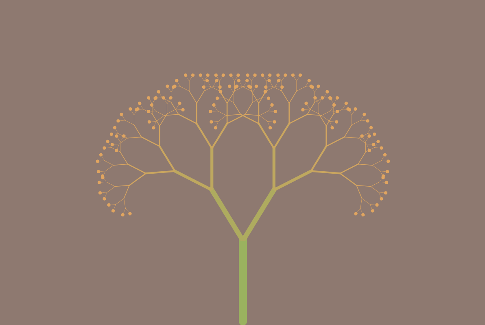
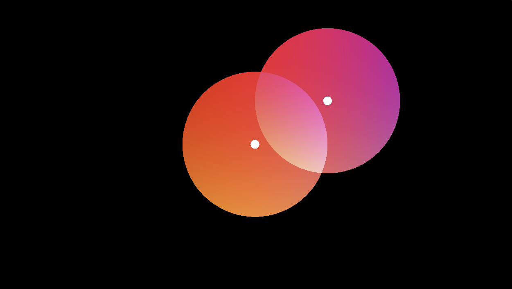

# rc-creative-coding

Code that is used for artistic expression, mainly using p5.js and shaders.

## [Flower Garden](https://github.com/nadia-nh/rc-creative-coding/tree/main/flower-garden)

## [Path Maker](https://github.com/nadia-nh/rc-creative-coding/tree/main/path-maker)

## [Flower Pomodoro](https://github.com/nadia-nh/rc-creative-coding/tree/main/flower-pomodoro)

## [Recursive Geometry](https://github.com/nadia-nh/rc-creative-coding/tree/main/recursive-geometry)

## [Rainbow Spiral](https://github.com/nadia-nh/rc-creative-coding/tree/main/rainbow-spiral)

## [Rings And Planets](https://github.com/nadia-nh/rc-creative-coding/tree/main/rings-and-planets)

## [Shifting Spheres](https://github.com/nadia-nh/rc-creative-coding/tree/main/shifting-spheres)

---

Made with <3 at [The Recurse Center](https://recurse.com).
