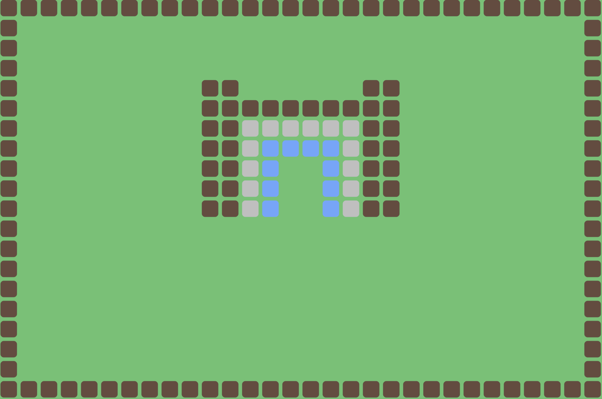
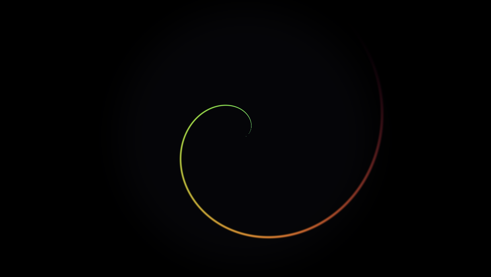

# rc-creative-coding

Code that is used for artistic expression, mainly using p5.js and shaders.

## [Flower Garden](https://github.com/nadia-nh/rc-creative-coding/tree/main/flower-garden)

## [Path Maker](https://github.com/nadia-nh/rc-creative-coding/tree/main/path-maker)

## [Flower Pomodoro](https://github.com/nadia-nh/rc-creative-coding/tree/main/flower-pomodoro)

## [Rainbow Spiral](https://github.com/nadia-nh/rc-creative-coding/tree/main/rainbow-spiral)
